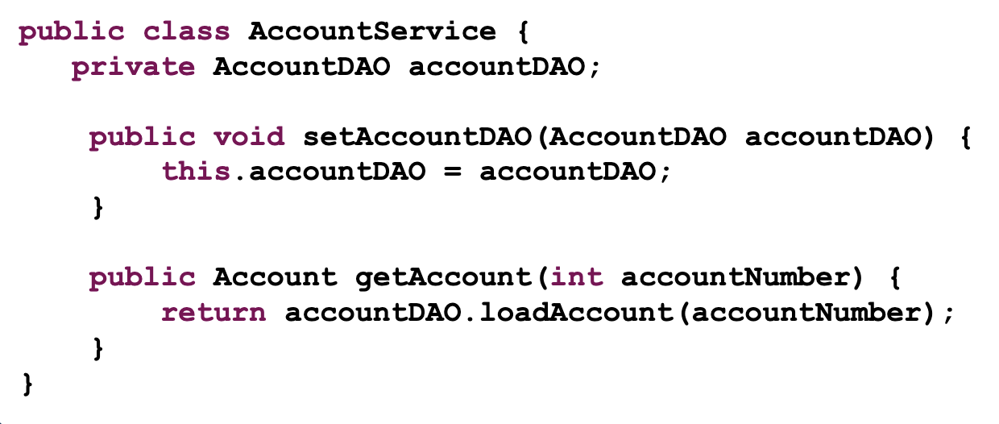
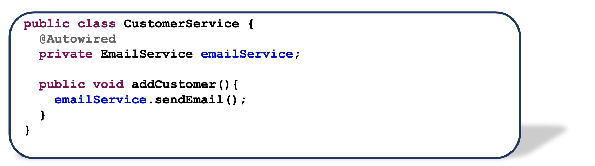

# My notes for lesson 1

## Note 1

try to use
private AccountDAO accountDAO;
instead of
private AccountDAO accountDAO = new AccountDAO();

To use the polymorphism features, so you can set it to any class that implement this class of interface.

## Note 2

The default of instantiation is eager, but you can make it lazy.
the reason for making the default as eager, so when ever you create the context it instantiation all the beans, then you get any error in any beans immediately not in run time when the user uses it. also the instantiation might take time so it's better to call it at the beginning of the application. the advantage of lazy is to save resources.

# Note 3

In case of optional parameters you need multiple constructors, then you need to use setter injection.

This only work in spring

