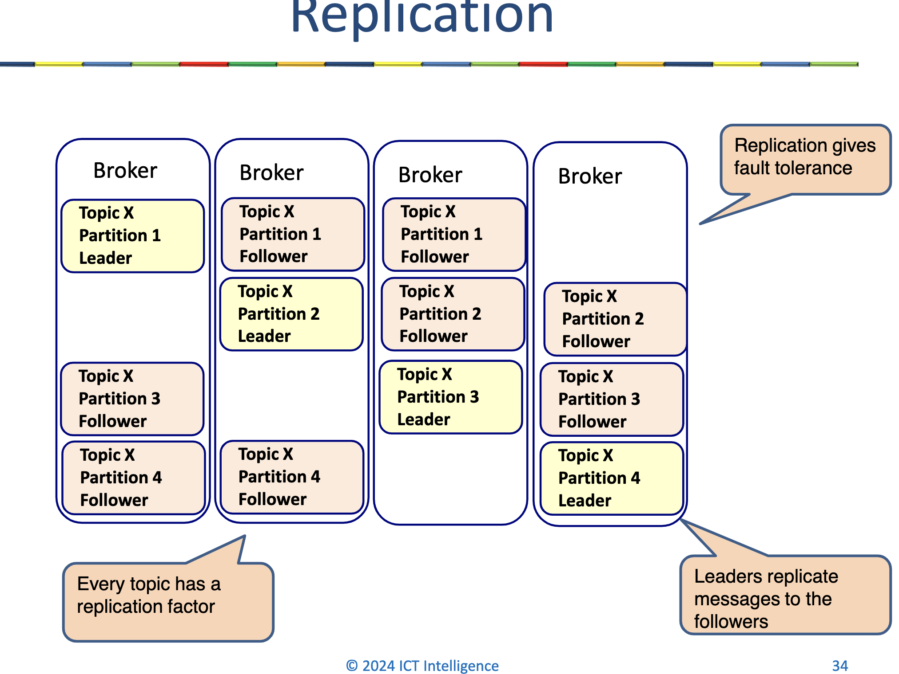
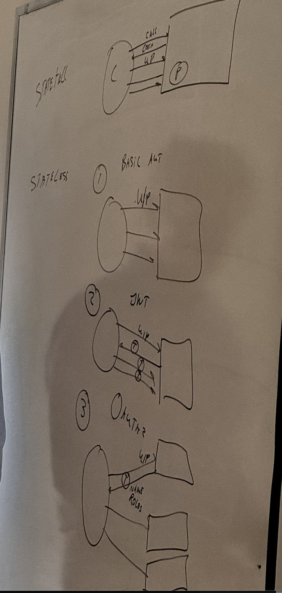
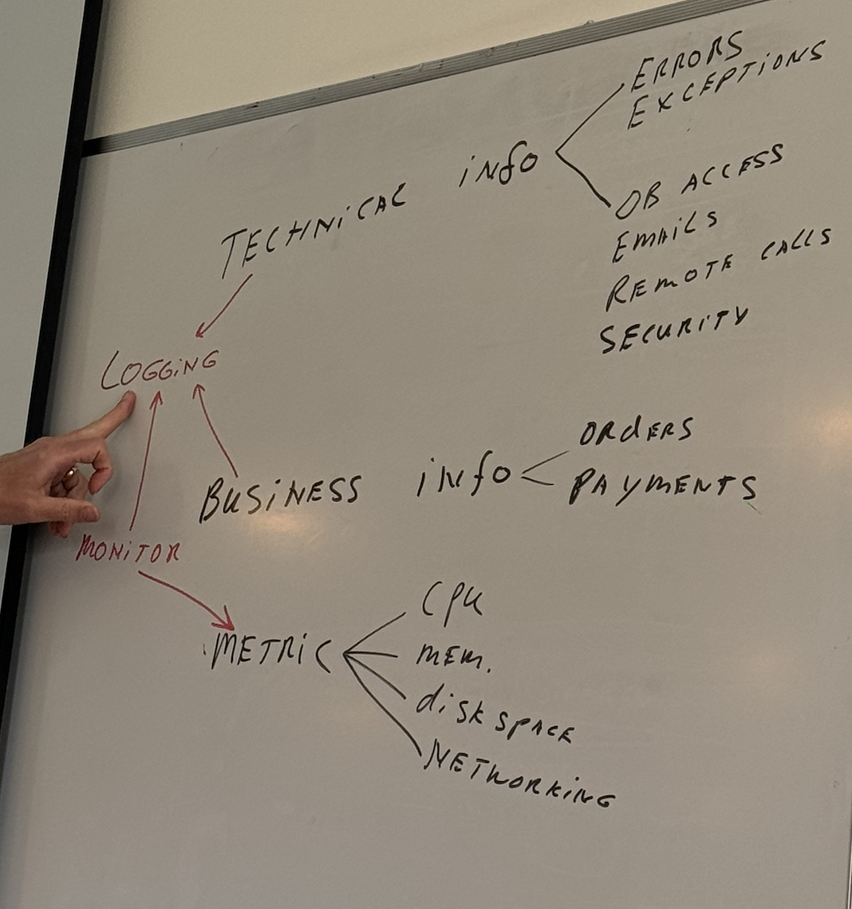
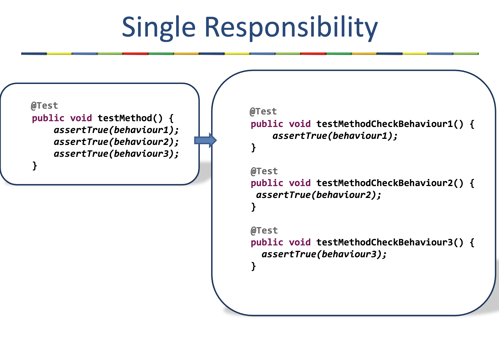
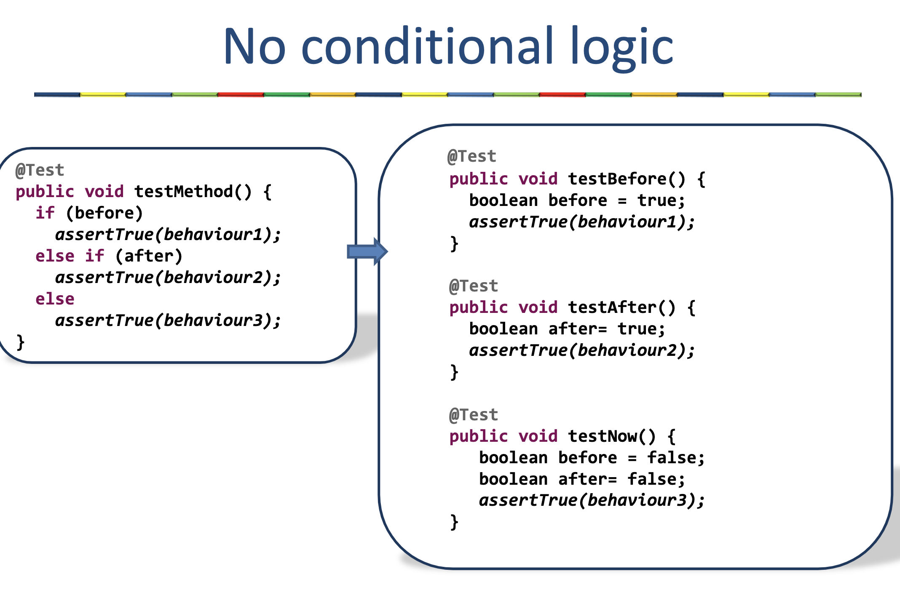
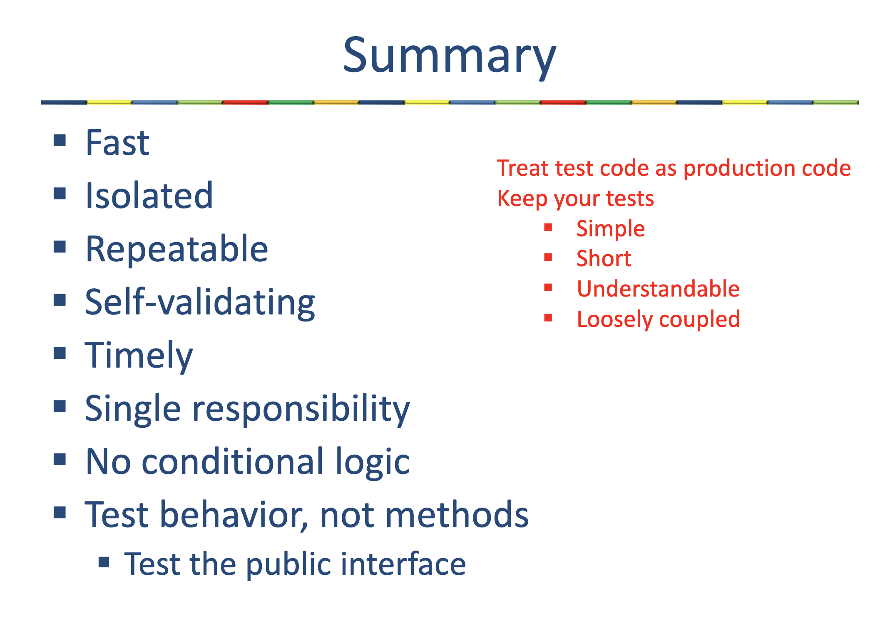
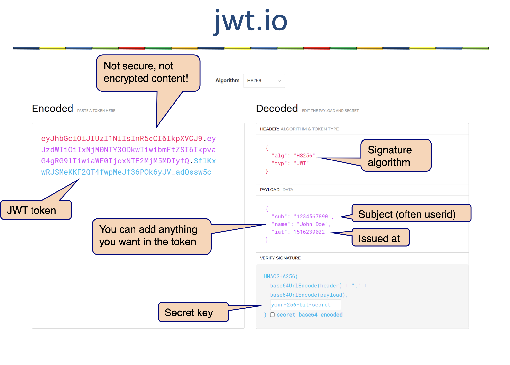
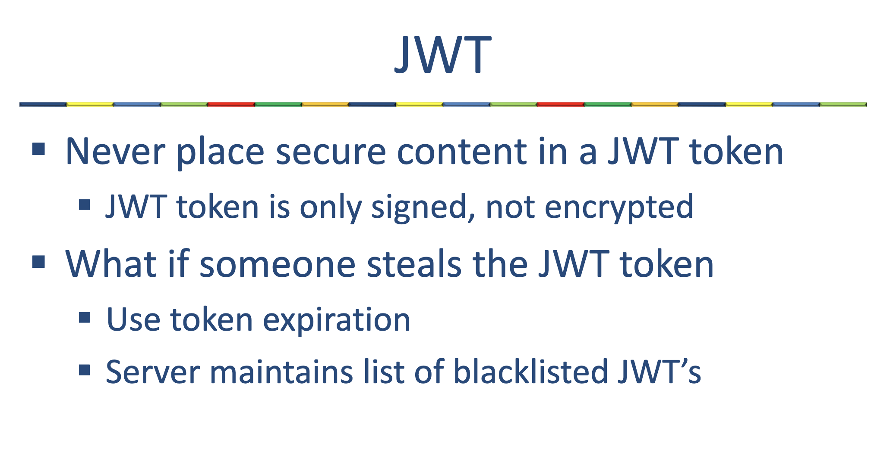
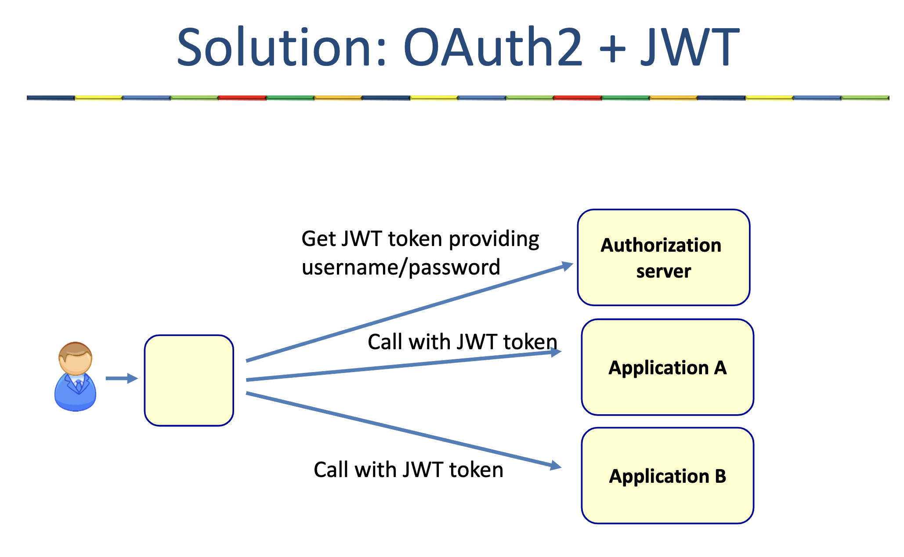

## SOAP

In a contract first approach we need to:

1. Create a xsd (XML schema) for our web service
2. Generate Java classes based on the xsd
3. Create implementation based on the generated
   Java classes

## rest vs messaging

| Category        | REST                                       | MESSAGING                                                                        |
| --------------- | ------------------------------------------ | -------------------------------------------------------------------------------- |
| Advantages      | - Can be used anywhere                     | - Middleware provides a buffer to collect messages until the receiver pulls them |
|                 | - Suitable for synchronous                 | - Loose coupling                                                                 |
|                 |                                            | - Supports pub-sub                                                               |
|                 |                                            | - Enables broadcasting                                                           |
| Disadvantages   | - No buffer                                | - Middleware typically only used within an organization                          |
|                 | - Tight coupling                           | - Single point of failure                                                        |
| When to use     | - When synchronous communication is needed | - When asynchronous (fire and forget) communication is needed                    |
|                 | - For communication between organizations  | - When broadcasting messages is required                                         |
| When not to use |                                            | - For communication outside the organization                                     |
|                 |                                            | - For web clients                                                                |

## Problems with traditional messaging middleware

- If the consumer is temporally not available (or very slow) the message middleware has to store the messages
  - This restricts the volume of messages and the size of the messages
  - Eventually the message broker will fail
- If the consumer has a bug, and handles the messages incorrectly, then the messages are gone.

# Every JmsListener method executes in its own thread / issues if the method not thread safe

## Each topic has one or more partitions

## Each partition must fit on 1 broker

## application event is by default synchronized

## Good unit tests: FIRST

- Fast
- Isolated
- Repeatable
- Self-validating
- Timely

## Unit test best practices

- Write tests for every found bug
- Fix failing tests immediately
- Make unit tests simple to run
- Test suites can be run by a single command or a one button click.
- An incomplete set of unit tests is better than no unit tests at all.
- Don’t repeat production logic
- Reuse test code (setup, manipulate, assert)
- Don’t run a test from another test

## Single Responsibility

- One test should be responsible for one scenario only.
- Test behavior, not methods:
- One method, multiple behaviors → Multiple tests
- One behavior, multiple methods → One test
  

## Self Descriptive

- Unit test must be easy to read and understand
- Variable Names
- Method Names
- Class Names
- No conditional logic
- No loops
- Name tests to represent PASS conditions:
- canMakeReservation()
- totalBillEqualsSumOfMenuItemPrices()

## Test only the public interface

- Every method has a side effect
- Test this side effect
- Test behavior, not methods
- What if this side effect is not visible (private attributes and methods)?
- Do not sacrifice good design just for testing
- Test behavior, not state

## Problem with stateful security

Hard to implement when we have multiple servers
Calling multiple applications from one app

## Problems with HTTP basic authentication

We have to send credentials for every request

## Problems with HTTP basic or JWT authentication

Every system needs to manage these credentials

