## Inversion of Control (IoC)

Inversion of Control (IoC) is a design principle where the control of object creation and dependency management is transferred from the program to the Spring framework. Instead of the application code creating instances of dependent objects directly, Spring Boot manages these dependencies through a process called Dependency Injection (DI). This means that Spring Boot handles the lifecycle and configuration of application components, injecting the necessary dependencies at runtime. This approach enhances modularity, testability, and maintainability of the code by decoupling the application logic from the creation and management of dependencies.

## writing beans using manual xml

```xml
<!-- Setter Injection -->
<!-- Setter injection is by name -->
<!-- Order of execution:
1. Instantiate the object
2. Call the constructor
3. Do the injection calling the setter method(s) -->
<!-- Issues:
▪ If the injection fails, you have an object in an invalid
state
▪ If you want to execute initialization code that uses the
injected attributes, then you cannot place this code in
the constructor, you need to write a separate init()
method -->
<bean id="accountService" class="AccountService" >
    <property name="accountDAO" ref="accountDAO">
</bean>
<bean id="accountDAO" class="AccountDAO" />

<!-- Constructor mapping is always by type -->
<!-- If 2 para is from the same type spring look at the order of the param -->
<!-- you can add index="0" -->
<!-- Order of execution:
1. Instantiate the object
2. Call the constructor and do the injection -->
<!-- Issues:
▪ You need constructor chaining with inheritance
▪ In case of optional parameters you need multiple
constructors -->
<bean id="accountService" class="AccountService" >
    <constructor-arg ref="accountDAO">
</bean>
<bean id="accountDAO" class="AccountDAO" />
```

## Autowiring

### by name

```xml
<!-- Autowire by name uses setter injection, so we need a setter method -->
<bean id="accountService" class="AccountService" autowire="byName" />
<bean id="accountDAO" class="AccountDAO" />
```

### by type

```xml
<!-- Autowire by type uses setter injection, so we need a setter method -->
<bean id="customerService" class="mypackage.CustomerService" autowire="byType"/>
 <bean id="eService" class="mypackage.EmailService"/>
```

## by constructor

```xml
<bean id="customerService" class="mypackage.CustomerService" autowire="constructor"/>
 <bean id="eService" class="mypackage.EmailService"/>
```

### Annotation based Autowiring

@Autowired on top of the constructor (by type)

@Autowired on top of the setter (by type)

@Autowired on top of the field ( 2 types ):

1. by type
2. by name: you need to specify the name of the bean by using @Qualifier("myEmailService")

## Injection of primitive values

```xml
<bean id="customerService" class="mypackage.CustomerServiceImpl">
      <property name="defaultCountry" value="USA"/>
      <property name="numberOfCustomers" value="56982"/>
    </bean>
```

```markdown
All classes with the annotations
▪ @Component
▪ @Service: For Service classes
▪ @Repository: For Data Access Objects
become spring beans
```

### Set the scope to prototype

The default scope is “singleton”

```java
@Service ("emailService")
@Scope("prototype")
public class EmailServiceImpl{
    ...
}

```

### @Value

```java
@Service ("emailService")
public class EmailServiceImpl {
  @Value("smtp.mailserver.com")
  private String emailServer;
  ...
}
```

## writing beans using AppConfig

```java
@Configuration
public class AppConfig {
  @Bean
  public CustomerService customerService(){
    CustomerService customerService = new CustomerServiceImpl();
    customerService.setEmailService(emailService());
    return customerService;
  }
  @Bean
  public EmailService emailService(){
    return new EmailServiceImpl();
  }
}
```

## Spring boot

```java
@SpringBootApplication
// @ComponentScan(basePackages = {"service"})
public class SpringBootProjectApplication implements CommandLineRunner {
  @Autowired
  private CustomerService customerService;

  public static void main(String[] args) {
  SpringApplication.run(SpringBootProjectApplication.class, args);
  }

  @Override
  public void run(String... args) throws Exception {
    customerService.addCustomer();
  }
}
```

```java
@Service
public class EmailServiceImpl implements EmailService{
@Value(" ${smtpserver}")
String smtpServer;
...
}
```

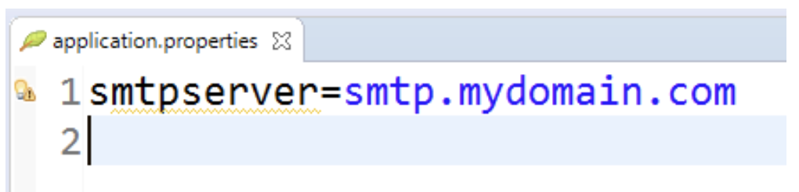

## DI

Spring does not know which class to inject

```java
@Service
public class GreetingService {
  @Autowired
  private Greeting greeting;

  public String getTheGreeting() {
    return greeting.getGreeting();
  }
}

@Component
public class GreetingTwo implements Greeting{
  public String getGreeting() {
    return "Hi World";
  }
}
@Component
public class GreetingOne implements Greeting{
  public String getGreeting() {
    return "Hello World";
  }
}
public interface Greeting {
  String getGreeting();
}
```

first solution is to use

```java
  @Qualifier(value="GreetingOne")
  private Greeting greeting;
```

Solution 2: use profiles
Set the active profile in application.properties
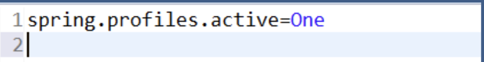

```java
@Component
@Profile("One")
public class GreetingOne implements Greeting{
  public String getGreeting() {
    return "Hello World";
  }
}

@Component
@Profile("Two")
public class GreetingTwo implements Greeting{
  public String getGreeting() {
    return "Hi World";
  }
}
```

## AOP

- Joinpoint: is a specific method in the class
- Pointcut: is a collection of methods
- Advice: is the implementation of the crosscutting concern
- Aspect: What Advice do I execute ? @Before, @After, @AfterReturning, @Afterthrowing, @Around
  and where =pointcut
- Weaving: Weave the advice code together with the target code at the corresponding pointcuts such that we get the correct execution, in simple words executing the code of the method in the correct advice.

```java
// getting the return value ,returning="retValue"

@Aspect
public class TraceAdvice {
  @AfterReturning(pointcut="execution(* mypackage.Customer.getName(..))",returning="retValue")
  public void tracemethod(JoinPoint joinpoint, String retValue) {
    System.out.println("method ="+joinpoint.getSignature().getName());
    System.out.println("return value ="+retValue);
  }
}

// Getting the exception ,throwing="exception"
@Aspect
public class TraceAdvice {
  @AfterThrowing(pointcut="execution(* mypackage.Customer.myMethod(..))",throwing="exception")
  public void tracemethod(JoinPoint joinpoint, MyException exception) {
     System.out.println("method ="+joinpoint.getSignature().getName());
     System.out.println("exception message ="+exception.getMessage());
  }
}

// Get parameters  && args(name)
// or
//   Object[] args = joinpoint.getArgs();
//   String name = (String)args[0];
@Aspect
public class TraceAdvice {
  @Before("execution(* mypackage.Customer.setNameAndAge(..)) && args(name,age)")
  public void tracemethod(JoinPoint joinpoint, String name, int age) {
     System.out.println("method ="+joinpoint.getSignature().getName());
     System.out.println("parameter name ="+name);
     System.out.println("parameter age ="+age);
  }
}

// Get the target class, (Customer)joinpoint.getTarget();
@Aspect
public class TraceAdvice {
 @After("execution(* mypackage.Customer.setName(..))")
   public void tracemethod(JoinPoint joinpoint) {
     Customer customer = (Customer)joinpoint.getTarget();
     System.out.println("method ="+joinpoint.getSignature().getName());
     System.out.println("customer age ="+customer.getAge());
  }
}
```

## JPA

using custom sequence

```java
@Entity
@SequenceGenerator(name="personSeq", sequenceName="PERSON_SEQUENCE")
public class Person_annotated_sequence {
  @Id
  @GeneratedValue(generator="personSeq")
  private long id;
  ...
}
```

### Annotation Types

- Use @Column to specify more details
- Use @Temporal to specify how a Date should be persisted (DATE, TIME or TIMESTAMP)
- Use @Lob to indicate Large values
- Use @Transient to indicate that a property should not be persisted

```java
  @Entity
public class Person {
  @Id
  @GeneratedValue
  private long id;
  @Column(name="FULLNAME", length=255, nullable=false)
  private String name;
  @Temporal(TemporalType.DATE)
  private Date birthday;
  @Lob
  private String biography;
  @Transient
  private String temp;
}
```

## Uni-Directional

foreign key will be in the car table because we annotated it with join column
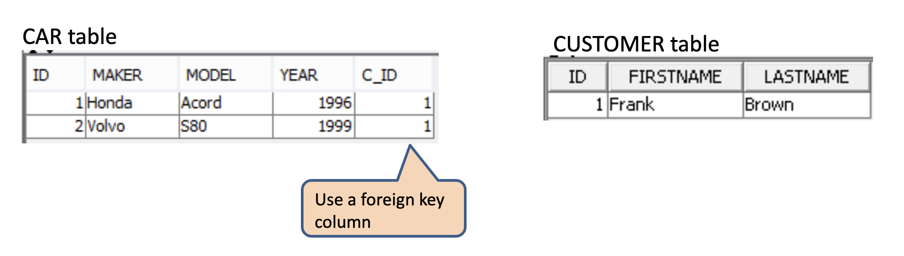

```java
@Entity
public class Car {
  @Id
  @GeneratedValue
  private int id;
  private short year;
  private String model;
  private String maker;
  @ManyToOne
  @JoinColumn(name="c_id")
  private Customer customer;
}
@Entity
public class Customer {
  @Id
  @GeneratedValue
  private int id;
  private String firstname;
  private String lastname;
}
```

the jpa will create a join table because we use jointable
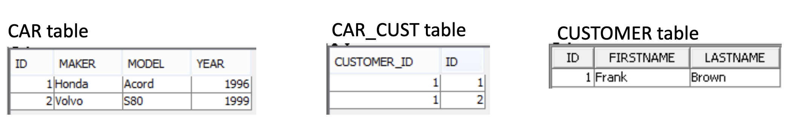

```java
@Entity
public class Car {
  @Id
  @GeneratedValue
  private int id;
  private short year;
  private String model;
  private String maker;
  @ManyToOne
  @JoinTable(name="car_cust")
  private Customer customer;
}
@Entity
public class Customer {
  @Id
  @GeneratedValue
  private int id;
  private String firstname;
  private String lastname;
}
```

@OneToMany and @ManyToMany the default is join table

@OneToMany you can make it joincolumn

## Bi-Directional

the join column will be in the many side, the one side has mappedBy
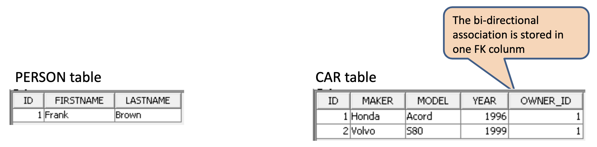

```java
@Entity
public class Person {
  @Id
  @GeneratedValue
  private int id;
  private String firstname;
  private String lastname;
  @OneToMany(mappedBy="owner")
  private List<Car> cars =
            new ArrayList<Car>();
}
@Entity
public class Car {
  @Id
  @GeneratedValue
  private int id;
  private short year;
  private String model;
  private String maker;
  @ManyToOne
  @JoinColumn(name="owner_id")
  private Person owner;
}
```

JPA does not support a real OneToOne
workaround is to use @PrimaryKeyJoinColumn
the left id will be the same as the right id, so the 2 tables will have the same id for the joined records
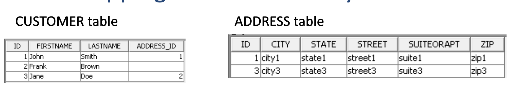

```java
@Entity
public class Customer {
  @Id
  @GeneratedValue
  private int id;
  private String firstname;
  private String lastname;
  @OneToOne
  private Address address
}
@Entity
public class Address {
  @Id
  @GeneratedValue
  private int id;
  private String street;
  private String suiteOrApt;
  private String city;
  private String state;
  private String zip;
}
```

```java
@Entity
public class Customer {
  @Id
  @GeneratedValue
  private int id;
  private String firstname;
  private String lastname;
  @OneToOne
  @PrimaryKeyJoinColumn
  private Address address;
}
@Entity
public class Address {
  @Id
  @GeneratedValue
  private int id;
  private String street;
  private String suiteOrApt;
  private String city;
  private String state;
  private String zip;
}
```

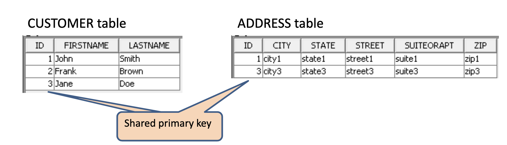

JoinTable customization

```
@JoinTable(name = "Customer_SalesPerson",
    joinColumns = { @JoinColumn(name = "Customer_id") },
    inverseJoinColumns = { @JoinColumn(name = "SalesPerson_id") }
  )
```

### Cascades

```
@OneToMany(cascade=CascadeType.PERSIST)
@OneToMany(cascade={CascadeType.PERSIST, CascadeType.MERGE})
ALL Cascade on all operations
PERSIST Cascade on persist operations
MERGE Cascade on merge operations
REMOVE Cascade on remove operations
REFRESH Cascade on refresh operations
```

### JPA default fetching

- @OneToOne defaults to eager loading
- @ManyToOne defaults to eager loading
- @OneToMany defaults to lazy loading
- @ManyToMany defaults to lazy loading

```
Changing the default fetching
@OneToMany(fetch=FetchType.EAGER)
@ManyToOne(fetch=FetchType.LAZY)
```

```java
// Mapping a not ordered List (1)
@OneToMany(mappedBy="owner", cascade=CascadeType.PERSIST)
private Collection<Tool> tools = new ArrayList<Tool>();

// Mapping a not ordered List (2)
@OneToMany(mappedBy="owner", cascade=CascadeType.PERSIST)
private List<Tool> tools = new ArrayList<Tool>();

// Sets are bags that can not contain duplicates:
// ▪ A set still has no inherent order
// ▪ A set can not contain duplicates

@OneToMany(mappedBy="toolbox", cascade=CascadeType.PERSIST)
private Set<Tool> tools = new HashSet<Tool>();

// One to Many bi-directional ordered List
@OneToMany(cascade=CascadeType.PERSIST)
@JoinColumn(name="buyer_id")
@OrderColumn(name="sequence")
private List<Item> shopList = new ArrayList<Item>();

// @OrderBy
@OneToMany(mappedBy="owner", cascade=CascadeType.PERSIST)
@OrderBy(clause="type ASC") // DESC
private List<Tool> tools = new ArrayList<Tool>();

// Map
@OneToMany(mappedBy="owner", cascade=CascadeType.PERSIST)
@MapKey(name="name")
private Map<String, Pet> pets = new HashMap<String, Pet>();
```

## INHERITANCE MAPPING

Three ways to map:

- Single Table per Hierarchy

  - De-normalized schema
  - Fast polymorphic queries
  - (+) Simple, Easy to implement
  - (+) Good performance on all queries, polymorphic and non polymorphic
  - (-) Nullable columns / de-normalized schema
  - (-) Table may have to contain lots of columns
  - (-) A change in any class results in a change of this table

```java
@Inheritance(strategy=InheritanceType.SINGLE_TABLE)
@DiscriminatorColumn(name="account_type")
public abstract class Account{
  ...
}
@Entity
@DiscriminatorValue("savings")
public class SavingsAccount extends Account {
  ...
}
@Entity
@DiscriminatorValue("checking")
public class CheckingAccount extends Account {
}
```


- Joined Tables

  - Normalized & similar to classes
  - Slower queries
  - (+) Normalized Schema
  - (+) Database view is similar to domain view
  - (-) Inserting or updating an entity results in multiple insert or update statements
  - (-) Necessary joins can give bad query performance

  ```java
  @Entity
  @Inheritance(strategy = InheritanceType.JOINED)
  public abstract class Account {
    @Id
    @GeneratedValue
    private long number;
    private double balance;
  }
  @Entity
  public class CheckingAccount extends Account {
    private double APY;
  }
  @Entity
  public class SavingsAccount extends Account {
    private double overdraftLimit;
  }
  ```

  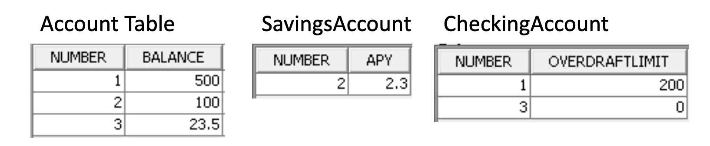
  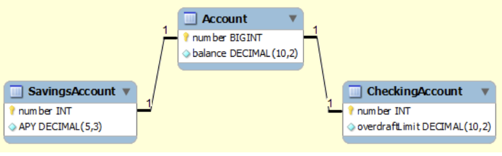

- Table per Concrete Class
  - Uses UNION instead of JOIN
  - All needed columns in each table
  - (+) Simple table structure
  - (+) No Null values
  - (+) Very efficient non-polymorphic queries
  - (+) No joins needed
  - (-) Can not use Identity column ID generation
  - (-) JPA does not require its implementation (optional)
  - (-) Requires a UNION for polymorphic queries

```java
@Entity
@Inheritance(strategy = InheritanceType.TABLE_PER_CLASS)
public abstract class Account {
  @Id
  @GeneratedValue(strategy=GenerationType.TABLE)
  private long number;
  private double balance;
}
@Entity
public class SavingsAccount extends Account {
  private Double APY;
}
@Entity
public class CheckingAccount extends Account {
  private Double overdraftLimit;
}
```

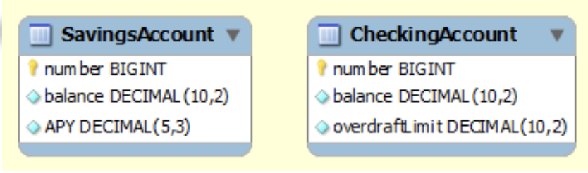

## Secondary Table

```java
@Entity
@SecondaryTables(
  @SecondaryTable(name="warehouse", pkJoinColumns = {
    @PrimaryKeyJoinColumn(name="product_id", referencedColumnName="number")
  }
))
public class Product {
  @Id
  @GeneratedValue
  private int number;
  private String name;
  private BigDecimal price;
  @Column(table="warehouse")
  private boolean available;
}
```

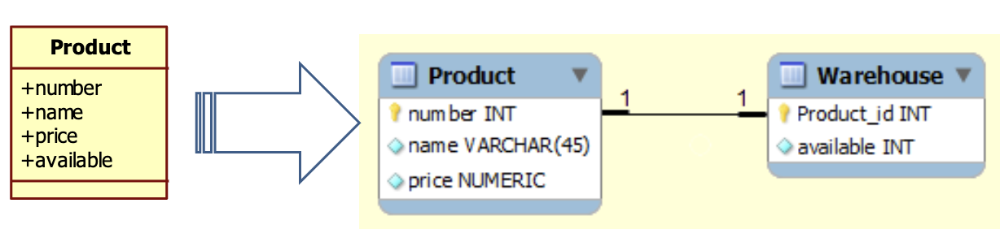

## Embedded Classes

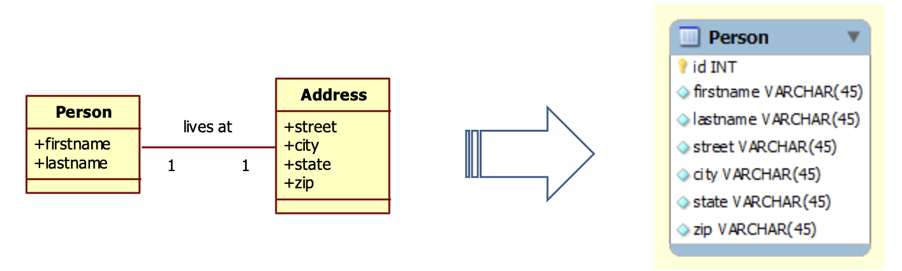

```java
@Entity
public class Person {
  @Id
  @GeneratedValue
  private int id;
  private String firstname;
  private String lastname;
  @Embedded
  private Address address;
}
@Embeddable
public class Address {
  private String street;
  private String city;
  private String state;
  private String zip;
}
```

to rename the columns

```java
  @Embedded
  @AttributeOverrides( {
    @AttributeOverride(name="street", column=@Column(name="ship_street")),
    @AttributeOverride(name="city", column=@Column(name="ship_city")),
    @AttributeOverride(name="state", column=@Column(name="ship_state")),
    @AttributeOverride(name="zip", column=@Column(name="ship_zip"))
  })
  private Address shipping;
```

## Composite Keys

```java
@Embeddable
public class Name implements Serializable {
  private String firstname;
  private String lastname;
}
@Entity
public class Employee {
  @Id
  private Name name;
}
```

```java
@Entity
public class Employee {
  @Id
  private Name name;
  @Temporal(TemporalType.DATE)
  private Date startDate;
  @OneToMany(mappedBy = "owner")
  private List<Project> projects = new ArrayList<Project>();
}
@Entity
public class Project {
  @Id
  @GeneratedValue
  private int id;
  private String name;
  @ManyToOne
  @JoinColumns( {
    @JoinColumn(name = "Emp_firstname", referencedColumnName = "firstname"),
    @JoinColumn(name = "Emp_lastname", referencedColumnName = "lastname")
  })
  private Employee owner;
}
```

## DTO

review the DTO code

## Queries

## METHOD BASED QUERY

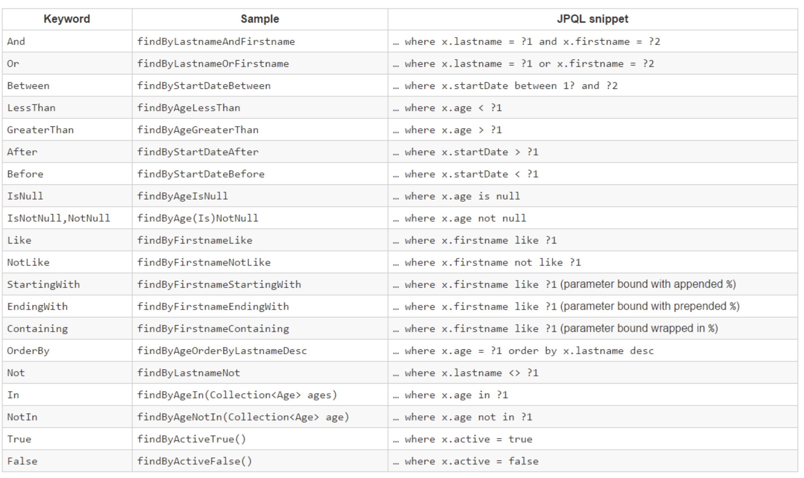

## Using @Query

```java
public interface CustomerRepository extends JpaRepository<Customer, Long> {
  @Query("select c from Customer c JOIN c.creditcards cr where cr.number= :number")
  List<Customer> findCustomersByCreditCardNumber(@Param("number") String number);
}
```

## Named query

```java
@Entity
@NamedQuery(name="Employee.findByFirstName", query="select e from Employee e where e.firstname = :name")
public class Employee {
@Id
@GeneratedValue
private int id;
private String firstname;
private String lastname;
...
}

public interface EmployeeRepository extends JpaRepository<Employee, Long> {

    Employee findByFirstName(String name);
}
```

## Using native queries

```java
public interface CustomerRepository extends JpaRepository<Customer, Long> {
    List<Customer> findByLastName(String lastName);

    @Query(value = "SELECT * FROM customer WHERE EMAIL = :email", nativeQuery = true)
    Customer findByEmail(@Param("email") String email);
}
```

## Specification

```java
public interface BookRepository extends JpaRepository<Book, Integer>, JpaSpecificationExecutor<Book> {
}
public class BookSpecifications {
  public static Specification<Book> hasInTitle(String title) {
      return (root, query, criteriaBuilder) -> criteriaBuilder.like(root.get("title"), "%" + title + "%");
  }
}

Specification<Book> titlespec = BookSpecifications.hasInTitle("Harry");
List<Book> harryBooks = bookrepository.findAll(titlespec);

List<Book> pricyBooksFromAuthor =
bookrepository.findAll(Specification.where(authorWithFirstNamespec).and(priceGreatherThanspec));
```

## Optimization

### Update and delete

```java
public interface CustomerRepository extends JpaRepository<Customer, Long> {
    List<Customer> findByLastName(String lastName);

    @Modifying
    @Transactional
    @Query("update Customer cust set cust.firstName = :firstname where cust.lastName = :lastname")
    int setFixedFirstnameFor(@Param("firstname") String firstName, @Param("lastname") String lastName);

    @Modifying
    @Transactional
    @Query("delete Customer c where c.status = :status")
    int deleteCustomerByStatus(@Param("status") String status);
}
```

## make everything lazy

```java
@ManyToOne(fetch = FetchType.LAZY)
@OneToMany //is already lazy

// to make it eager  join fetch
@Query("select c from Customer c join fetch c.address")
List<Customer> findByFirstnameEager(String name);

// OneToMany with distinct join fetch
@Query("select distinct c from Customer c join fetch c.creditcards")
List<Customer> findByFirstnameEager(String name);

```

## Transactions

### Transaction propagation

- REQUIRED
- REQUIRES_NEW
- MANDATORY
- SUPPORTS
- NEVER
- NOT_SUPPORTED

### 4 levels of isolation

- TransactionReadUncommitted
- TransactionReadCommitted
- TransactionRepeatableRead
- TransactionSerializable

### 3 transaction problems

- Dirty read
- Non repeatable read
- Phantom read

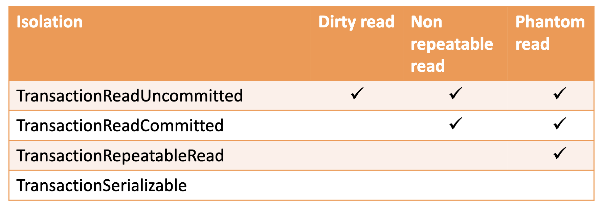

```java
// rollbackFor
@Transactional(rollbackFor = {DAOException.class})

@Transactional
public void createCustomerAccount(int customerid, String customerName,){
  ....
}

@Transactional(propagation=Propagation.REQUIRES_NEW, isolation=Isolation.REPEATABLE_READ)
public void createCustomerAccount(String customerName, int accountnumber){
...
}
```

## Version Column

First commit wins instead of last commit wins

```java
@Entity
public class Customer {
  @Id
  @GeneratedValue
  private int id;
  private String firstname;
  private String lastname;
  @Version
  private int version;
}
```

## MongoDB

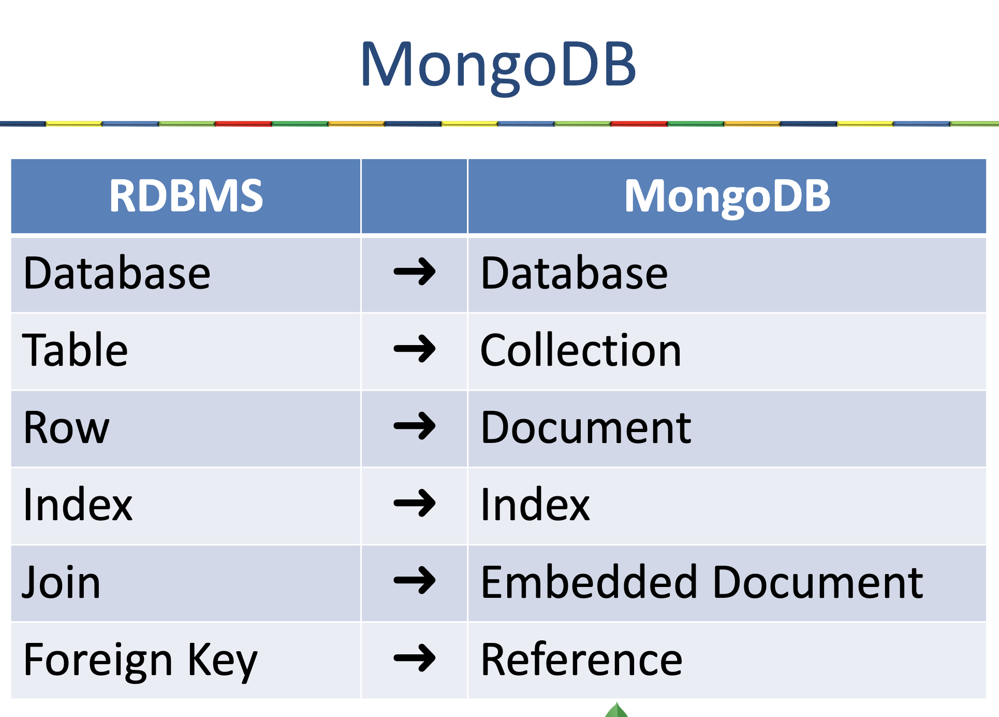

```java
@Document
public class Customer {
   @Id
   private int customerNumber;
   private String name;
   private String email;
   private String phone;
  //  this
   private CreditCard creditCard;
  //  or this
   @DBref
   private CreditCard creditCard;
  //  or this
   private List<CreditCard> creditCards = new ArrayList<CreditCard>();
}
public class CreditCard {
    private String cardNumber;
    private String type;
    private String validationDate;
}
```

```java
@Repository
public interface CustomerRepository extends MongoRepository<Customer, Integer> {
    Customer findByPhone(String phone);
    Customer findByEmail(String email);
    List<Customer> findByCreditCardType(String type);
    @Query("{email : :#{#email}}")
    Customer findCustomerWithEmail(@Param("email") String email);

}
```
